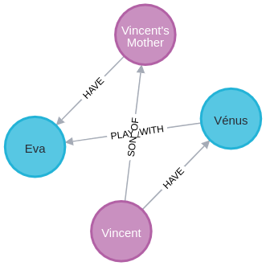

### Delete the entire database content:
```
MATCH (n) DETACH DELETE n
```

### Import de database content:
```
CREATE (:Anime {name: "Demon Slayer"})<-[:WATCH]-(n0:Person {name: "Vincent", location: "Montpellier"})-[:HAVE {since: "July 2024"}]->(:Cat {name: "Vénus", race: "Ragdoll"})-[:PLAY_WITH]->(:Cat {name: "Eva"})<-[:HAVE]-(n6:Person {name: "Vincent's Mother", location: "Somewhere"}),
(:Programming {language: "TypeScript"})<-[:LOVES]-(n0)-[:LOVES]->(:Programming {language: "Java"}),
(n0)-[:SON_OF]->(n6)
```

### Get Persons
```
MATCH (n:Person)
RETURN n
```


### Get Persons that have a Cat
```
MATCH (a:Person)-[r:HAVE]->(b:Cat)
RETURN a, r, b
```



### Get only some fields of nodes
```
MATCH (a:Person)-[r:HAVE]->(b:Cat)
RETURN a.name, r, b.name
```
```
╒══════════════════╤════════════════════════════╤═══════╕
│a.name            │r                           │b.name │
╞══════════════════╪════════════════════════════╪═══════╡
│"Vincent"         │[:HAVE {since: "July 2024"}]│"Vénus"│
├──────────────────┼────────────────────────────┼───────┤
│"Vincent's Mother"│[:HAVE]                     │"Eva"  │
└──────────────────┴────────────────────────────┴───────┘
```


### Get persons that have a Cat where the name of this Person is "Vincent"
```
MATCH (a:Person)-[r:HAVE]->(b:Cat)
WHERE a.name = "Vincent"
RETURN a, r, b
```


### Task 6
```
MATCH (m:Movie)<-[:ACTED_IN]-(a:Person)
WITH m, collect(a) as Actors
WHERE size(Actors) > 2
RETURN m.title, size(Actors) as NumberOfActors
```

```
╒════════════════════════╤══════════════╕
│m.title                 │NumberOfActors│
╞════════════════════════╪══════════════╡
│"A Few Good Men"        │12            │
├────────────────────────┼──────────────┤
│"The Matrix"            │5             │
├────────────────────────┼──────────────┤
│"The Matrix Reloaded"   │4             │
├────────────────────────┼──────────────┤
│"The Matrix Revolutions"│4             │
├────────────────────────┼──────────────┤
│"The Devil's Advocate"  │3             │
├────────────────────────┼──────────────┤
│"Top Gun"               │6             │
├────────────────────────┼──────────────┤
│"Jerry Maguire"         │9             │
├────────────────────────┼──────────────┤
│"Stand By Me"           │7             │
├────────────────────────┼──────────────┤
│"As Good as It Gets"    │4             │
├────────────────────────┼──────────────┤
│"What Dreams May Come"  │5             │
├────────────────────────┼──────────────┤
│"Snow Falling on Cedars"│4             │
├────────────────────────┼──────────────┤
│"You've Got Mail"       │6             │
├────────────────────────┼──────────────┤
│"Sleepless in Seattle"  │6             │
├────────────────────────┼──────────────┤
│"Joe Versus the Volcano"│3             │
├────────────────────────┼──────────────┤
│"When Harry Met Sally"  │4             │
├────────────────────────┼──────────────┤
│"That Thing You Do"     │3             │
├────────────────────────┼──────────────┤
│"The Replacements"      │4             │
├────────────────────────┼──────────────┤
│"RescueDawn"            │4             │
├────────────────────────┼──────────────┤
│"The Birdcage"          │3             │
├────────────────────────┼──────────────┤
│"Unforgiven"            │3             │
├────────────────────────┼──────────────┤
│"Johnny Mnemonic"       │4             │
├────────────────────────┼──────────────┤
│"Cloud Atlas"           │4             │
├────────────────────────┼──────────────┤
│"The Da Vinci Code"     │4             │
├────────────────────────┼──────────────┤
│"V for Vendetta"        │5             │
├────────────────────────┼──────────────┤
│"Speed Racer"           │7             │
├────────────────────────┼──────────────┤
│"Ninja Assassin"        │4             │
├────────────────────────┼──────────────┤
│"The Green Mile"        │8             │
├────────────────────────┼──────────────┤
│"Frost/Nixon"           │5             │
├────────────────────────┼──────────────┤
│"Hoffa"                 │4             │
├────────────────────────┼──────────────┤
│"Apollo 13"             │5             │
├────────────────────────┼──────────────┤
│"Twister"               │4             │
├────────────────────────┼──────────────┤
│"Something's Gotta Give"│3             │
├────────────────────────┼──────────────┤
│"Charlie Wilson's War"  │3             │
├────────────────────────┼──────────────┤
│"A League of Their Own" │6             │
└────────────────────────┴──────────────┘
```

### Task 7
```
MATCH (m:Movie)
RETURN MIN(m.released), MAX(m.released)
```
```
╒═══════════════╤═══════════════╕
│MIN(m.released)│MAX(m.released)│
╞═══════════════╪═══════════════╡
│1975           │2012           │
└───────────────┴───────────────┘
```

### Task 8
```
MATCH (m:Movie{title:'Joe Versus the Volcano'})
SET m.genre = "Love Story"
RETURN m
```

```
╒══════════════════════════════════════════════════════════════════════╕
│m                                                                     │
╞══════════════════════════════════════════════════════════════════════╡
│(:Movie {genre: "Love Story",tagline: "A story of love, lava and burni│
│ng desire.",title: "Joe Versus the Volcano",released: 1990})          │
└──────────────────────────────────────────────────────────────────────┘
```

### Task 9

```
CREATE (m:Movie {title: 'The World War Five'})
CREATE (p:Person{name: 'Vincent'})
CREATE (p)-[:ACTED_IN]->(m)
```

### Task 10

```
MATCH (p:Person{name: "Vincent"})
DETACH DELETE p
```

### Task 11
https://github.com/faaizshah/do5-2025
https://medium.com/@faaizhussain/loading-json-in-neo4j-1e3e396fd219

```
WITH “file:///nvdcve-1.1–2024.json” as url 
CALL apoc.load.json(url) YIELD value 
UNWIND keys(value) AS key
RETURN key, apoc.meta.type(value[key]);
```