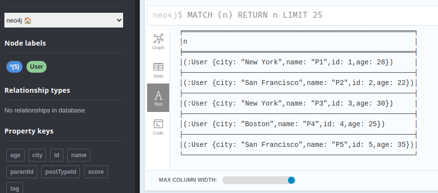
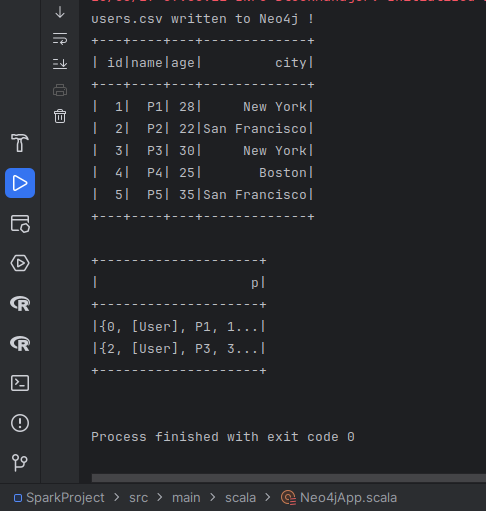

## Neo4j Connector

### Here is my code:

```scala
val spark = SparkSession.builder
      .appName("Neo4j Spark Application")
      .config("spark.driver.memory", "8G")
      .config("neo4j.url", "bolt://localhost:7687")
      .config("neo4j.authentication.basic.username", "neo4j")
      .config("neo4j.authentication.basic.password", "password")
      .master("local[*]")
      .getOrCreate()

spark.sparkContext.setLogLevel("ERROR")

val schema = new StructType()
    .add("id", LongType, nullable = true)
    .add("name", StringType, nullable = true)
    .add("age", LongType, nullable = true)
    .add("city", StringType, nullable = true)

val df = spark.read
    .option("header", "true")
    .schema(schema)
    .csv("data/users.csv")


df.write
    .format("org.neo4j.spark.DataSource")
    .mode(SaveMode.Append)
    .option("labels", ":User")
    .save()

println("users.csv written to Neo4j !")

val df2 = spark.read
    .format("org.neo4j.spark.DataSource")
    .schema(schema)
    .option("labels", "User")
    .load()

df2.show()


val neo4jDF = spark.read
    .format("org.neo4j.spark.DataSource")
    .option("query", "MATCH (p:User {city: 'New York'}) RETURN p")
    .load()

neo4jDF.show()

spark.stop()
```

**As we can see the data is well written:**



**And the data is read, after:**



**This is the output of my code above**