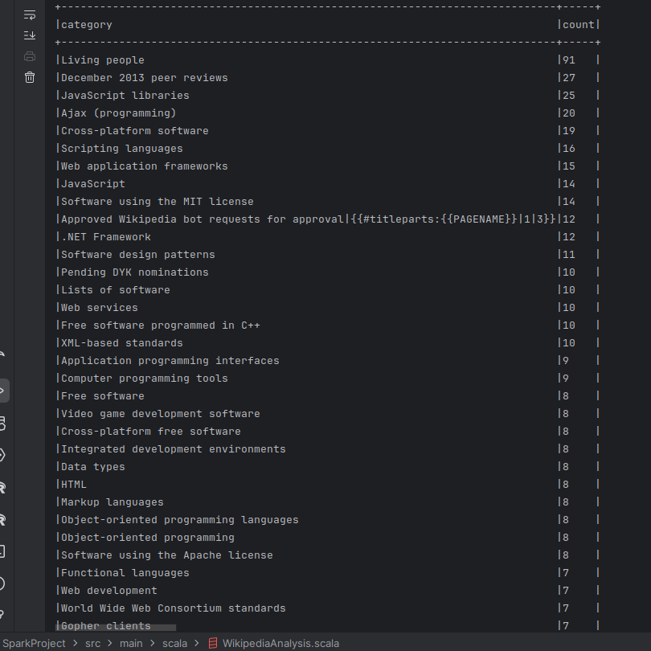
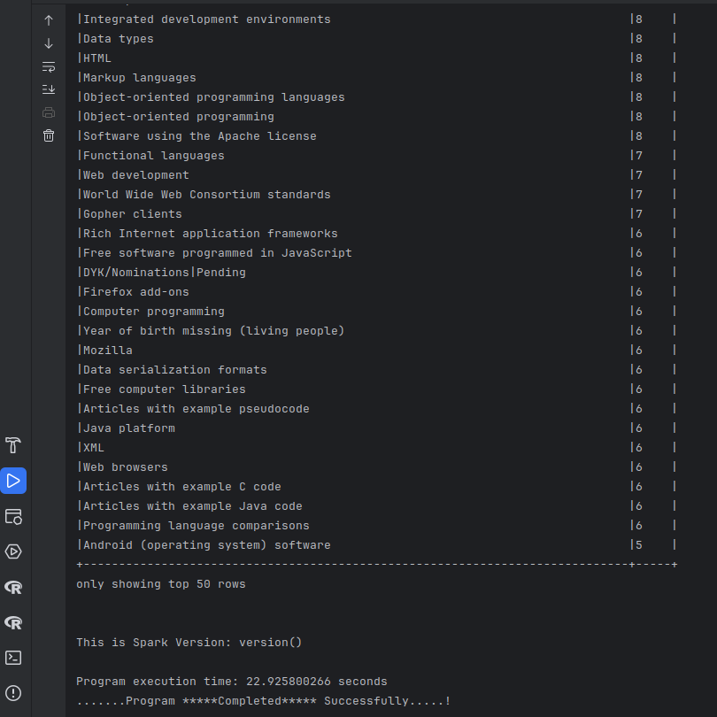

# Wikipedia Data Analysis + NLP

### Load the file

```scala
val file = "data/wikipedia.dat"
val spark = SparkSession.builder
    .appName("Wikipedia Analysis Application")
    .master("local[*]")
    .getOrCreate()

val rawData = spark.read
    .textFile(file)
```

### Identify the fields (Title, text, category, reference, redirect)

These fields are identified by these patterns:

```scala
val titlePattern = "<title>(.*?)</title>".r
val textPattern = "<text>(.*?)</text>".r
val isRedirect = text.contains("#REDIRECT")
val categoryPattern = "\\[\\[Category:(.*?)]]".r
```

### Convert the raw data in dataframe

```scala
val rawData = spark.read
    .textFile(file)

val extractedDf = rawData.map { line =>
    val titlePattern = "<title>(.*?)</title>".r
    val textPattern = "<text>(.*?)</text>".r

    val title = titlePattern.findFirstMatchIn(line).map(_.group(1)).getOrElse("")
    val text = textPattern.findFirstMatchIn(line).map(_.group(1)).getOrElse("")
    val isRedirect = text.contains("#REDIRECT")

    WikiPage(title, text, isRedirect)
}.toDF()
```

### Count top 50 categories

```scala
val categoryPattern = "\\[\\[Category:(.*?)]]".r

val extractCategories = udf { text: String =>
    categoryPattern.findAllMatchIn(text).map(_.group(1)).toSeq
}

val wikiWithCategories = extractedDf
    .withColumn("categories", extractCategories(col("text")))

wikiWithCategories.select("title", "categories").show(false)

val exploded = wikiWithCategories
    .withColumn("category", explode(col("categories")))

exploded.groupBy("category")
    .count()
    .orderBy(desc("count"))
    .show(50, truncate = false)
```


