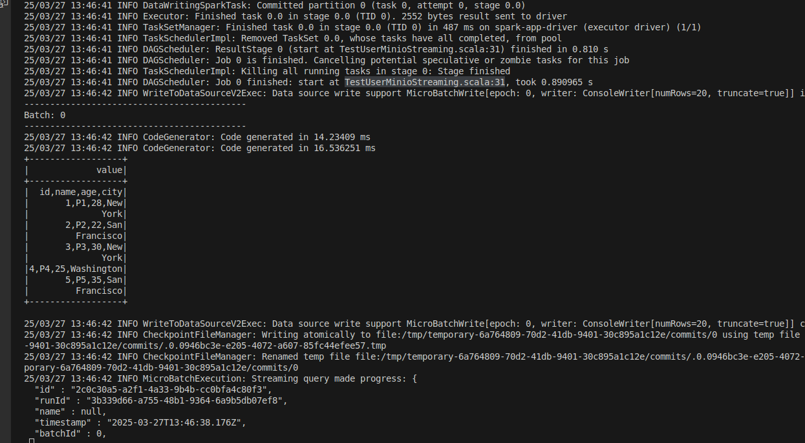
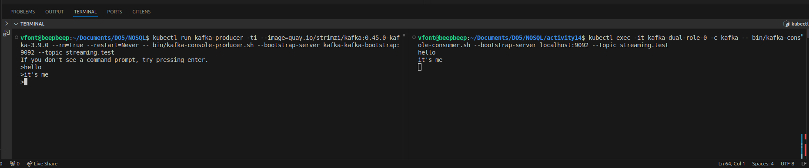
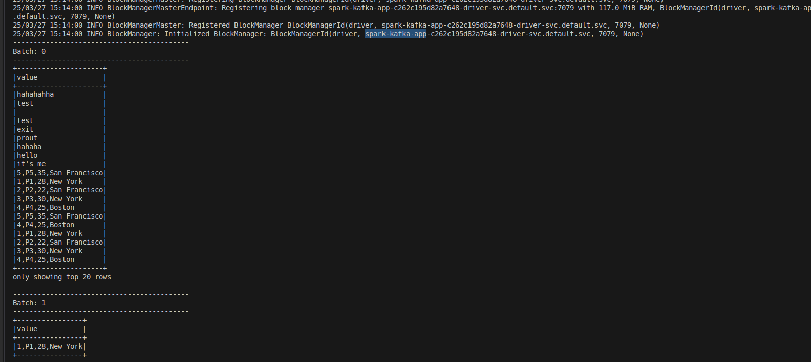
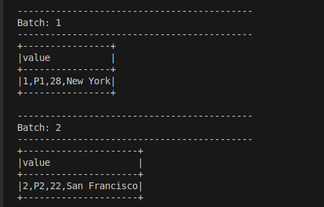

# Implement Apacha Spark File Streaming

## Build the Spark project jar:

Change the `build.sbt` file to change the main class to `TestUserMinioStreaming`

Execute inside the root of the Spark Project:
```sh
$ sbt assembly
```
### Minio
Take the jar file and upload it to the minio do5 bucket

Create a user with an access key and put it into the `spark-app.yaml`


### Build the docker image

Run it inside the root of the Spark Project:
```sh
$ docker login 10.43.0.50:5000
$ docker build -t 10.43.0.50:5000/spark-app .
$ docker push 10.43.0.50:5000/spark-app
```

Create the Spark Application with the docker image
```sh
$ kubectl apply -f spark-app.yaml
```

I just had to modify the users.csv file and re-upload it to minio and I can see that it works !



# Implement Apache Spark With Kafka Streaming

## Install Strimzi Kafka Operator

```sh
$ helm repo add strimzi https://strimzi.io/charts/
$ helm install strimzi-kafka-operator strimzi/strimzi-kafka-operator
```

**Create the Kafka Cluster**

```sh
$ kubectl apply -f kafka-cluster.yml
```

**Create topic on Kafka**

```sh
$ kubectl exec -it kafka-dual-role-0 -c kafka -- bin/kafka-console-consumer.sh --bootstrap-server localhost:9092 --topic streaming.test
```

**List Kafka Topics**

```sh
$ kubectl exec -it kafka-dual-role-0 -c kafka -- bin/kafka-topics.sh --bootstrap-server localhost:9092 --topic streaming.test --list
```

**Publish some data to the kafka**

```sh
$ kubectl run kafka-producer -ti --image=quay.io/strimzi/kafka:0.45.0-kafka-3.9.0 --rm=true --restart=Never -- bin/kafka-console-producer.sh --bootstrap-server kafka-kafka-bootstrap:9092 --topic streaming.test
```



## Build the Spark project jar:

Change the `build.sbt` file to change the main class to `KafkaStreaming`

Execute inside the root of the Spark Project:
```sh
$ sbt assembly
```
### Minio
Take the jar, rename it `SparkKafkaStreaming.jar` and upload it to the minio do5 bucket

## Build Image with Kafka

At the root of the SparkProject, I needed to launch the docker build for the image that includes kafka dependencies with Spark:

```sh
$ docker login 10.43.0.50:5000
$ docker build -t 10.43.0.50:5000/spark-kafka .
$ docker push 10.43.0.50:5000/spark-kafka
```

### Run the Spark Kafka Application

Execute this command:
```sh
$ kubectl apply -f spark-kafka-app.yaml
```

Produce some data to the Kafka topic:
```sh
$ kubectl run kafka-producer -ti --image=quay.io/strimzi/kafka:0.45.0-kafka-3.9.0 --rm=true --restart=Never -- bin/kafka-console-producer.sh --bootstrap-server kafka-kafka-bootstrap:9092 --topic streaming.test
```

**It works !**



As I can see, the output show the new content of the kafka topic in Real time:

