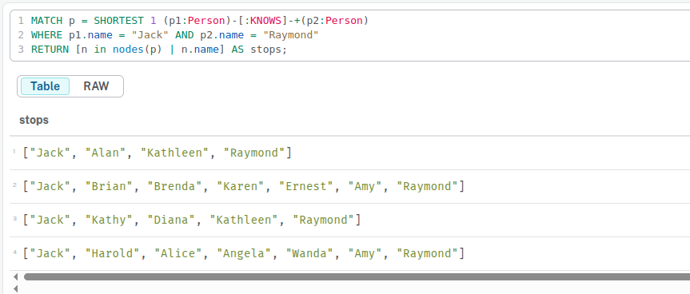

## Create a GDS Project
```
CALL gds.graph.project(
    'routes',
    'Airport',
    'HAS_ROUTE'
)
YIELD
    graphName, nodeProjection, nodeCount, relationshipProjection, relationshipCount
```

```
╒═════════╤═════════════════════════════════════════════╤═════════╤══════════════════════════════════════════════════════════════════════╤═════════════════╕
│graphName│nodeProjection                               │nodeCount│relationshipProjection                                                │relationshipCount│
╞═════════╪═════════════════════════════════════════════╪═════════╪══════════════════════════════════════════════════════════════════════╪═════════════════╡
│"routes" │{Airport: {label: "Airport", properties: {}}}│3503     │{HAS_ROUTE: {aggregation: "DEFAULT", orientation: "NATURAL", indexInve│46389            │
│         │                                             │         │rse: false, properties: {}, type: "HAS_ROUTE"}}                       │                 │
└─────────┴─────────────────────────────────────────────┴─────────┴──────────────────────────────────────────────────────────────────────┴─────────────────┘
```

## Get all possible nodes count
```
CALL db.labels() YIELD label
CALL apoc.cypher.run('MATCH (:`'+label+'`) RETURN count(*) as count',{}) YIELD value
RETURN label, value.count
```

## Get all relationships possible
```
CALL db.relationshipTypes() YIELD relationshipType as type
CALL apoc.cypher.run('MATCH ()-[:`'+type+'`]->() RETURN count(*) as count',{}) YIELD value
RETURN type, value.count
```

```
MATCH (:Airport)-[r:HAS_ROUTE]->(:Airport)
RETURN COUNT(r)
```

## Count labels and relationships in the same query
```
CALL apoc.meta.stats() YIELD labels, relTypesCount
RETURN labels, relTypesCount
```
## Centrality
```
CALL gds.pageRank.stream('routes')
YIELD nodeId, score
WITH gds.util.asNode(nodeId) AS n, score AS pageRank
RETURN n.iata AS iata, n.descr AS description, pageRank
ORDER BY pageRank DESC, iata ASC
```

## Write pageRank property 

```
CALL gds.pageRank.write('routes',
    {
        writeProperty: 'pageRank'
    }
)
YIELD nodePropertiesWritten, ranIterations
```

## Show the airports with pageRank
```
MATCH (a:Airport)
RETURN a.iata AS iata, a.descr AS description, a.pageRank AS pageRank
ORDER BY a.pageRank DESC, a.iata ASC
```

## Uncovering distinct clusters or communities of nodes, shedding light on cohesive groups or substructures within a graph. 

```
CALL gds.louvain.stream('routes')
YIELD nodeId, communityId
WITH gds.util.asNode(nodeId) AS n, communityId
RETURN
    communityId,
    SIZE(COLLECT(n)) AS numberOfAirports,
    COLLECT(DISTINCT n.city) AS cities
ORDER BY numberOfAirports DESC, communityId;
```

## Node similarity
```
CALL gds.nodeSimilarity.stream('routes')
YIELD node1, node2, similarity
WITH gds.util.asNode(node1) AS n1, gds.util.asNode(node2) AS n2, similarity
RETURN
    n1.iata AS iata,
    n1.city AS city,
    COLLECT({iata:n2.iata, city:n2.city, similarityScore: similarity}) AS similarAirports
ORDER BY city LIMIT 20
```

## Node similarity: topN and bottomN
```
CALL gds.nodeSimilarity.stream(
    'routes',
    {
        topK: 1,
        topN: 10
    }
)
YIELD node1, node2, similarity
WITH gds.util.asNode(node1) AS n1, gds.util.asNode(node2) AS n2, similarity AS similarityScore
RETURN
    n1.iata AS iata,
    n1.city AS city,
    {iata:n2.iata, city:n2.city} AS similarAirport,
    similarityScore
ORDER BY city
```

## Creating a weighted graph projection

```
CALL gds.graph.project(
    'routes-weighted',
    'Airport',
    'HAS_ROUTE',
    {
        relationshipProperties: 'distance'
    }
) YIELD
    graphName, nodeProjection, nodeCount, relationshipProjection, relationshipCount
```

## Dijkstra’s algorithm: calculating the shortest path given a source node

```
MATCH (source:Airport {iata: 'DEN'})
MATCH (target:Airport {iata: 'MLE'})
CALL gds.shortestPath.dijkstra.stream('routes-weighted', {
    sourceNode: source,
    targetNode: target,
    relationshipWeightProperty: 'distance'
})
YIELD index, sourceNode, targetNode, totalCost, nodeIds, costs, path
RETURN
    index,
    gds.util.asNode(sourceNode).iata AS sourceNodeName,
    gds.util.asNode(targetNode).iata AS targetNodeName,
    totalCost,
    [nodeId IN nodeIds | gds.util.asNode(nodeId).iata] AS nodeNames,
    costs,
    nodes(path) as path
ORDER BY index
```

### Give me the details of all the Crimes under investigation by Officer Larive (Badge Number 26-5234182)
```
MATCH (c:Crime {last_outcome: "Under investigation"})-[i:INVESTIGATED_BY]->(o:Officer {badge_no: "26-5234182", surname: "Larive"})
RETURN c, i, o;
```

There is 8 crimes found


## shortest path between jack and raymond
```
MATCH p = SHORTEST 1 (p1:Person)-[:KNOWS|KNOWS_LW|KNOWS_PHONE|KNOWS_SN]-+(p2:Person)
WHERE p1.name = "Jack" AND p2.name = "Raymond"
RETURN [n in nodes(p) | n.name] AS stops
ORDER BY size(stops) ASC;
```


