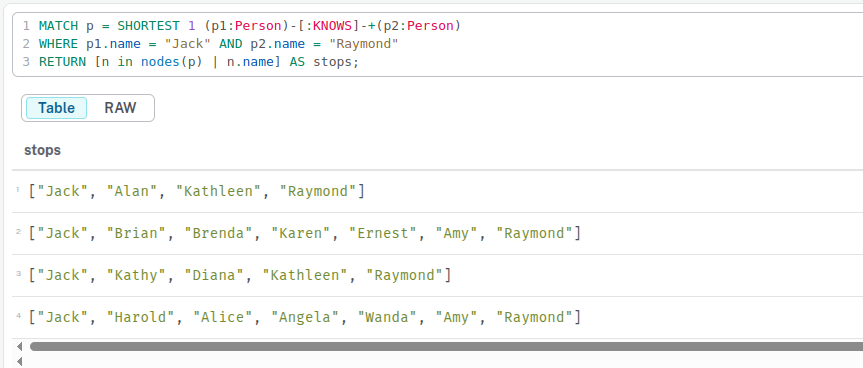

### Give me the details of all the Crimes under investigation by Officer Larive (Badge Number 26-5234182)
```
MATCH (c:Crime {last_outcome: "Under investigation"})-[i:INVESTIGATED_BY]->(o:Officer {badge_no: "26-5234182", surname: "Larive"})
RETURN c, i, o;
```

There is 8 crimes found


## Shortest path between jack and raymond
```
MATCH p = SHORTEST 1 (p1:Person)-[:KNOWS|KNOWS_LW|KNOWS_PHONE|KNOWS_SN]-+(p2:Person)
WHERE p1.name = "Jack" AND p2.name = "Raymond"
RETURN [n in nodes(p) | n.name] AS stops
ORDER BY size(stops) ASC;
```


## Find the details of all crimes under investigation by Officer Larive (badge number 26-5234182)
```
MATCH (:Officer{badge_no: "26-5234182"})<-[:INVESTIGATED_BY]-(c:Crime{last_outcome: "Under investigation"}) 
RETURN c
```
there are 8 crimes showing up

## Find all crimes that Officer Larive has investigated
```
MATCH (:Officer{badge_no: "26-5234182"})<-[:INVESTIGATED_BY]-(c:Crime)
RETURN c
```

## To get the crimes under investigations about the type drugs: 
```
MATCH (o:Officer{badge_no: "26-5234182"})<-[i:INVESTIGATED_BY]-(c:Crime{last_outcome: "Under investigation", type: "Drugs"}) 
RETURN o, i, c
```
### There are 3 investigations


## Find the shortest path between two persons
```
MATCH p = SHORTEST 1 (p1:Person{name: "Jack", surname: "Powell"})-[:KNOWS|KNOWS_LW|KNOWS_PHONE|KNOWS_SN|FAMILY_REL]-+(p2:Person{name:"Raymond", surname:"Walker"})
RETURN [n in nodes(p) | n.name] AS stops
```
```
stops
["Jack", "Alan", "Kathleen", "Raymond"]
```

## Find the connection between the people involded in both crimes
```
MATCH (c:Crime {last_outcome: 'Under investigation', type: 'Drugs'})-[:INVESTIGATED_BY]->(:Officer {badge_no: '26-5234182'}),
(c)<-[:PARTY_TO]-(p:Person)
WITH COLLECT(p) AS persons
UNWIND persons AS p1
UNWIND persons AS p2
WITH * WHERE id(p1) < id(p2)
MATCH path = allshortestpaths((p1)-[:KNOWS|KNOWS_LW|KNOWS_SN|FAMILY_REL|KNOWS_PHONE*..3]-(p2)) // maximum 3 people away
RETURN path
```

