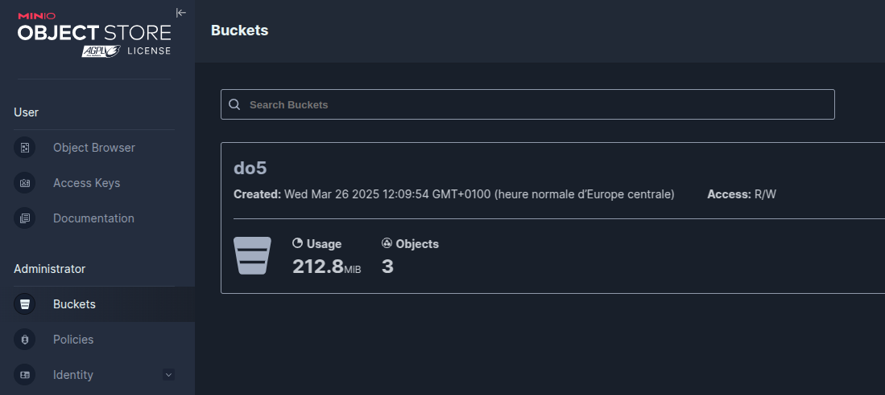
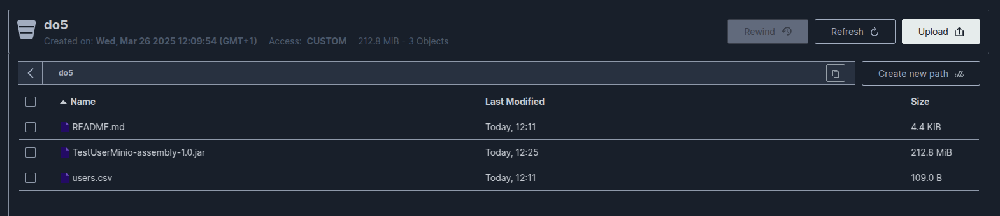
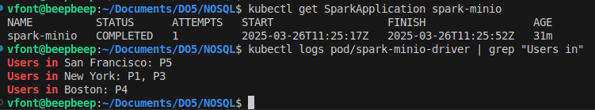

## Run the spark quick start program on Kubernetes using Spark 

## I'm using k3s

To install k3s
```sh
$ curl -sfL https://get.k3s.io | sh -
```

### Install the spark operator
```sh
$ helm repo add spark-operator https://kubeflow.github.io/spark-operator
$ helm install spark-operator spark-operator/spark-operator \
    --namespace spark-operator --create-namespace --wait
```

### Install minio operator
```sh
$ helm install minio oci://registry-1.docker.io/bitnamicharts/minio
```

### Get Minio credentials
```sh
$ kubectl get Secret minio -o jsonpath='{.data.root-user}' | base64 --decode

$ kubectl get Secret minio -o jsonpath='{.data.root-password}' | base64 --decode
```

### Expose minio to access the web UI
```sh
$ kubectl port-forward svc/minio 9001:9001
```

#### Then connect to http://127.0.0.1:9001/ with Minio credentials

#### Create a bucket named "do5"


#### Upload files into this bucket:
- users.csv
- README.md
- TestUserMinio-assembly-1.0.jar



### Create the Spark Application
```sh
$ kubectl apply -f spark-testuser.yaml
```

### Show the Spark Application
```sh
$ kubectl get SparkApplication spark-minio
$ kubectl logs pod/spark-minio-driver | grep 'Users in'
```

