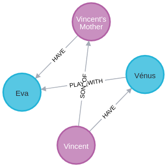
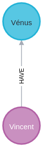

### Delete the entire database content:
```
MATCH (n) DETACH DELETE n
```

### Import de database content:
```
CREATE (:Anime {name: "Demon Slayer"})<-[:WATCH]-(n0:Person {name: "Vincent", location: "Montpellier"})-[:HAVE {since: "July 2024"}]->(:Cat {name: "Vénus", race: "Ragdoll"})-[:PLAY_WITH]->(:Cat {name: "Eva"})<-[:HAVE]-(n6:Person {name: "Vincent's Mother", location: "Somewhere"}),
(:Programming {language: "TypeScript"})<-[:LOVES]-(n0)-[:LOVES]->(:Programming {language: "Java"}),
(n0)-[:SON_OF]->(n6)
```

### Get Persons
```
MATCH (n:Person)
RETURN n
```


### Get Persons that have a Cat
```
MATCH (a:Person)-[r:HAVE]->(b:Cat)
RETURN a, r, b
```



### Get only some fields of nodes
```
MATCH (a:Person)-[r:HAVE]->(b:Cat)
RETURN a.name, r, b.name
```
```
╒══════════════════╤════════════════════════════╤═══════╕
│a.name            │r                           │b.name │
╞══════════════════╪════════════════════════════╪═══════╡
│"Vincent"         │[:HAVE {since: "July 2024"}]│"Vénus"│
├──────────────────┼────────────────────────────┼───────┤
│"Vincent's Mother"│[:HAVE]                     │"Eva"  │
└──────────────────┴────────────────────────────┴───────┘
```


### Get persons that have a Cat where the name of this Person is "Vincent"
```
MATCH (a:Person)-[r:HAVE]->(b:Cat)
WHERE a.name = "Vincent"
RETURN a, r, b
```

