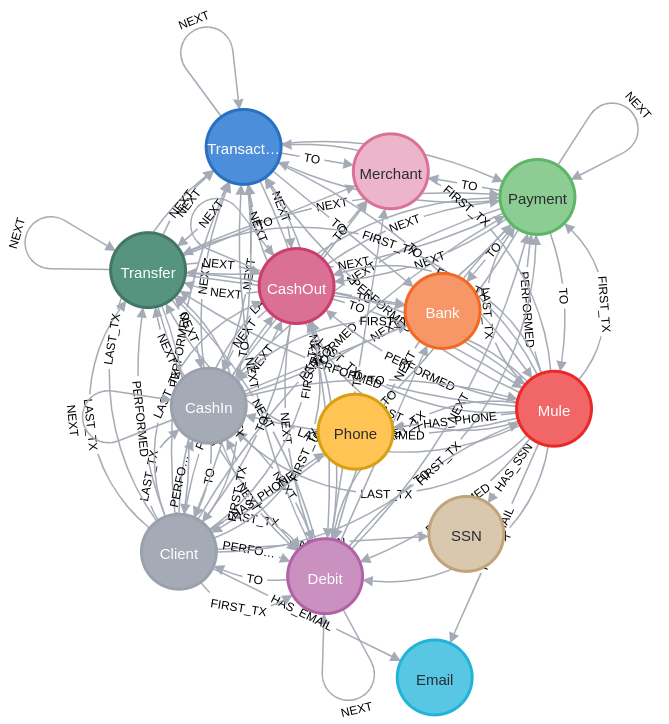
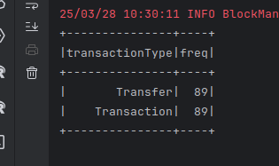
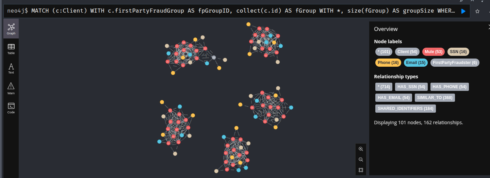
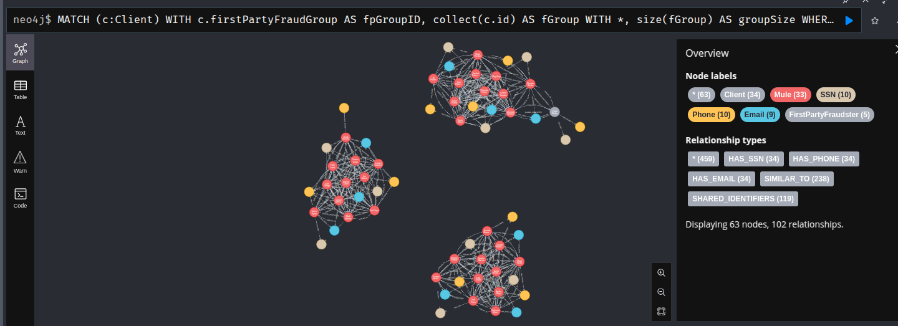

# Analyze the Fraud Detection dataset

## Schema Visualization



## Nodes Count

```
MATCH(n) RETURN COUNT(n)
```

```
╒════════╕
│COUNT(n)│
╞════════╡
│332973  │
└────────┘
```

## Relationships Count

```
MATCH ()-[r]->() RETURN count(r) AS total_relations;
```
```
╒═══════════════╕
│total_relations│
╞═══════════════╡
│980098         │
└───────────────┘
```


## Node labels and their Count

```
MATCH (n)
UNWIND labels(n) AS label
RETURN label, count(n) AS total_nodes;
```

```
╒═════════════╤═══════════╕
│label        │total_nodes│
╞═════════════╪═══════════╡
│"Client"     │2433       │
├─────────────┼───────────┤
│"Merchant"   │347        │
├─────────────┼───────────┤
│"CashIn"     │149037     │
├─────────────┼───────────┤
│"Transaction"│323489     │
├─────────────┼───────────┤
│"Mule"       │433        │
├─────────────┼───────────┤
│"Transfer"   │19460      │
├─────────────┼───────────┤
│"Payment"    │74577      │
├─────────────┼───────────┤
│"SSN"        │2238       │
├─────────────┼───────────┤
│"Email"      │2229       │
├─────────────┼───────────┤
│"Phone"      │2234       │
├─────────────┼───────────┤
│"Bank"       │3          │
├─────────────┼───────────┤
│"Debit"      │4392       │
├─────────────┼───────────┤
│"CashOut"    │76023      │
└─────────────┴───────────┘
```

## Relationship Types and their Count

```
MATCH ()-[r]->() RETURN type(r) AS relation_type, count(r) AS count_per_type;
```
```
╒═════════════╤══════════════╕
│relation_type│count_per_type│
╞═════════════╪══════════════╡
│"PERFORMED"  │323489        │
├─────────────┼──────────────┤
│"TO"         │323489        │
├─────────────┼──────────────┤
│"HAS_SSN"    │2433          │
├─────────────┼──────────────┤
│"HAS_EMAIL"  │2433          │
├─────────────┼──────────────┤
│"HAS_PHONE"  │2433          │
├─────────────┼──────────────┤
│"FIRST_TX"   │2332          │
├─────────────┼──────────────┤
│"LAST_TX"    │2332          │
├─────────────┼──────────────┤
│"NEXT"       │321157        │
└─────────────┴──────────────┘
```

# The 3 Questions
### Find out what types of transactions do these Clients perform with first party fraudsters

The query is that one
```sql
MATCH (:Client:FirstPartyFraudster)-[]-(txn:Transaction)-[]-(c:Client)
WHERE NOT c:FirstPartyFraudster
UNWIND labels(txn) AS transactionType
RETURN transactionType, count(*) AS freq;
```

Now I use it inside my Spark Application:

```scala
spark.read
    .format("org.neo4j.spark.DataSource")
    .option("query", "MATCH (:Client:FirstPartyFraudster)-[]-(txn:Transaction)-[]-(c:Client)\nWHERE NOT c:FirstPartyFraudster\nUNWIND labels(txn) AS transactionType\nRETURN transactionType, count(*) AS freq")
    .load()
    .show()
```

And it works !

**You can see all the code in the `FraudDetection.scala` file in the Spark Project**



### How many clusters of FraudRings with greater than 9 client nodes ?

#### To count the fraudRings:
```sql
MATCH (c:Client)
WITH c.firstPartyFraudGroup AS fpGroupID, collect(c.id) AS fGroup
WITH *, size(fGroup) AS groupSize WHERE groupSize > 9
WITH collect(fpGroupID) AS fraudRings
RETURN size(fraudRings)
```

#### I got this output:
```
╒════════════════╕
│size(fraudRings)│
╞════════════════╡
│5               │
└────────────────┘
```

#### To show the Graph:

```sql
MATCH (c:Client)
WITH c.firstPartyFraudGroup AS fpGroupID, collect(c.id) AS fGroup
WITH *, size(fGroup) AS groupSize WHERE groupSize > 9
WITH collect(fpGroupID) AS fraudRings
MATCH p=(c:Client)-[:HAS_SSN|HAS_EMAIL|HAS_PHONE]->()
WHERE c.firstPartyFraudGroup IN fraudRings
RETURN p
```

#### The output graph is the number of FraudRing clusters with > 9 client nodes



### How many clusters of FraudRings with greater than 10 client nodes ?

#### To count the fraudRings:

```sql
MATCH (c:Client)
WITH c.firstPartyFraudGroup AS fpGroupID, collect(c.id) AS fGroup
WITH *, size(fGroup) AS groupSize WHERE groupSize > 10
WITH collect(fpGroupID) AS fraudRings
RETURN size(fraudRings)
```

#### I got this output:

```
╒════════════════╕
│size(fraudRings)│
╞════════════════╡
│3               │
└────────────────┘
```

#### To show the Graph:

```sql
MATCH (c:Client)
WITH c.firstPartyFraudGroup AS fpGroupID, collect(c.id) AS fGroup
WITH *, size(fGroup) AS groupSize WHERE groupSize > 10
WITH collect(fpGroupID) AS fraudRings
MATCH p=(c:Client)-[:HAS_SSN|HAS_EMAIL|HAS_PHONE]->()
WHERE c.firstPartyFraudGroup IN fraudRings
RETURN p
```

